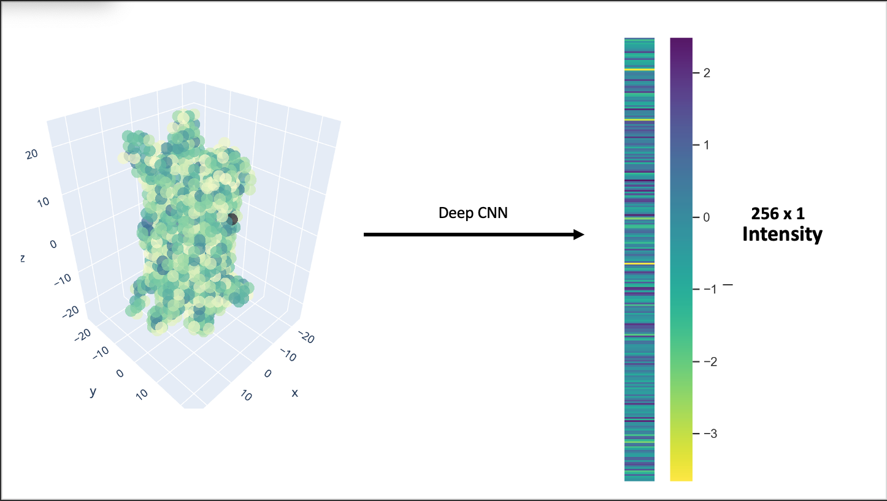
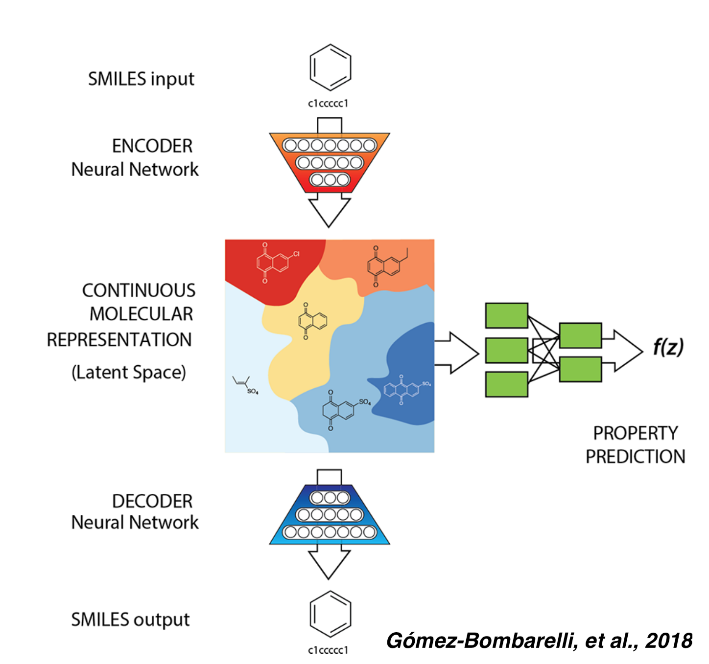
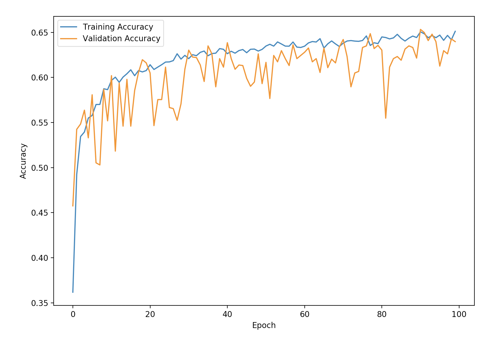

  

# cnns4qspr

A package for creating rich, equivariant, structural and chemical features from protein structure data.

## Installation

1. pip install git+https://github.com/AMLab-Amsterdam/lie_learn
2. pip install git+https://github.com/CNNs4QSPR/se3cnn.git
3. pip install git+https://github.com/CNNs4QSPR/cnns4qspr.git

## Overview

Scientists are continually finding applications for machine learning in all branches of science, and the field of structural biology is no exception. The purpose of the cnns4qspr package is to make extraction of high quality features from 3D protein structures as easy as possible for a user. Once a user has their desired features, they may use them for whatever machine learning task they desire.

#### Who can make use of this package:

This package is great for anyone trying to investigate quantitative structure-property relationships (QSPR) in proteins. Some examples include researchers studying de novo design, protein crystal-solvent interactions, solid interactions, and protein-ligand interactions. Generally speaking, anyone wanting to map protein-crystal structures to a property may find cnns4qspr useful.

#### Feature vector:

1.	The user must input the path of the pdb file to the functions featurize or gen_feature_set from featurizer.py.
2.	The function would return a set of feature vectors based on the channels specified.

#### Uses:

Compression of protein structural data into a feature vector. This can be used to convert pdb protein data in a structural information-dense vector space. This structural information vector can be used for:
1.	Training models for Structural classification prediction. (See examples)
2.	Reducing the computation expense for structure-to-property predictions.
3.	Decoders for identifying the features of the amino acid residues primarily responsible for the secondary structure.
4.	Training models for structure prediction in different solutions/environments.
5.	Recommender systems for protein sequence prediction.

## Package description and contents

cnns4qspr "voxelizes" protein structure data, so that data are in a form which is acceptable as input to a 3D convolutional neural network (CNN). Voxelization simply means the atomic coordinates are transformed from descrete points in 3D space, to slightly smeared atomic densities that fill "voxels" (3D pixels) in a new 3D picture of the protein.

### 1. Voxelization of protein data: loader.py
Voxelization of all the backbone atoms in green flourescent protein (GFP). Key aspects of the molecular sctructure of GFP are maintained throughout the transformation. Thus, the network will be able to "see" key structural information unique to GFP.

#### Custom atomic channel selection
A model is only as good as the data you feed it. Loader has the ability to voxelize relevant atomic "channels" to present relevant chemical information to a model.

Available channels for a protein include:
* Atoms of a particular type (C, CA, CB, O, N, ...)
* Atoms from a canonical residue (LYS, ALA, ...)
* Backbone atoms (C, CA, O, N) or sidechain atoms
* Atoms from residues with a certain property (charged, polar, nonpolar, acidic, basic, amphipathic)

### 2. Visualization of feature data: visualizer.py
Data visualization is key for holding inuition and control over what a model is doing. The visualizer.py module enables easy visualization of what features look like before entering the CNN, and after any of the convolutional filters within the CNN.

### 3. Feature extraction: featurizer.py
A model is only as good as the data you feed it. Below is a demonstration of the differences between cnns4qspr's voxelization of 'backbone', 'polar', and 'nonpolar' atomic channel selections a user can make when voxelizing a protein. The differences in chemical information are clear.

### 4. Training on extracted features: trainer.py
Variational autoencoders (VAEs) are a versatile tool for data compression, organization, interpolation, and generation. The trainer module allows users to create custom VAEs with regression or classification capabilities built into the latent space.

## Package accomplishments

### 1. Reproduced literature results after feature compression

### 2. Continuous latent space reoganization based on protein class

